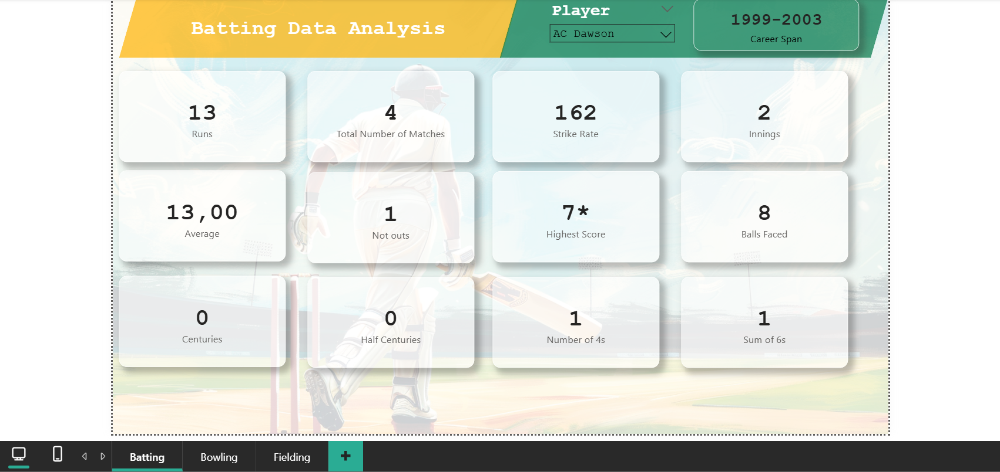

# 🏏 South Africa vs India Cricket Analysis

This Power BI report analyzes player performance from matches between South Africa and India, covering **batting, bowling, and fielding** statistics.

---

## 📌 Project Details
- **Tools Used**: Power BI, PowerQuery, DAX, Web Scraping (from ESPN)
- **Data Source**: ESPN cricket stats
- **Key DAX Functions**: `LOOKUPVALUE`, `RANKX`, `POWER`, `ABS`
- **Metrics**:
  - Runs scored per player
  - Wickets taken per player
  - Bowling strike rate and averages
  - Player performance ranking

---

## 📸 Dashboard Preview

---

## 🧠 Key Insights
- Top 5 performing players ranked using `RANKX`
- Strong correlation between batting average and win probability
- Player-specific performance trends across matches

