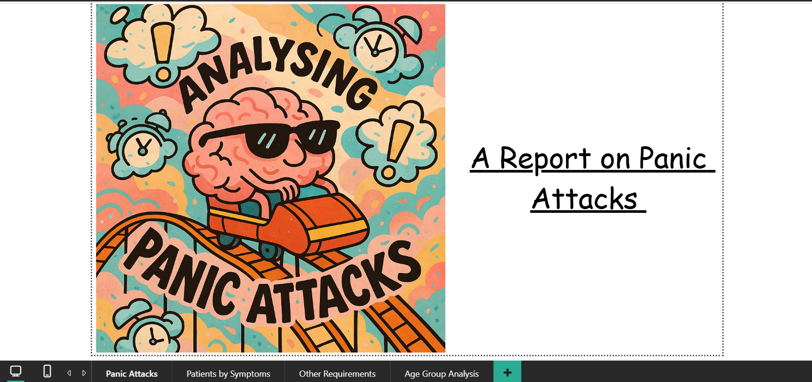

---

## 📂 **2. PowerBIProjects/PanicAttackInsights/README.md**
```markdown
# 🧠 Panic Attack Insights Dashboard

This Power BI report explores data on panic attacks to identify **patterns, triggers, and durations**.

---

## 📌 Project Details
- **Tools Used**: Power BI, Snowflake, PowerQuery, DAX
- **Data Source**: Uploaded datasets reviewed in Snowflake, then connected to Power BI
- **Key DAX Functions**: `IF`, `SWITCH`, `COUNTROWS`, `FILTER`, `DIVIDE`
- **Metrics**:
  - Panic attack duration distribution
  - Trigger types and frequency
  - Trends by age group

---

## 📸 Dashboard Preview
> Add your screenshot here  
```markdown

