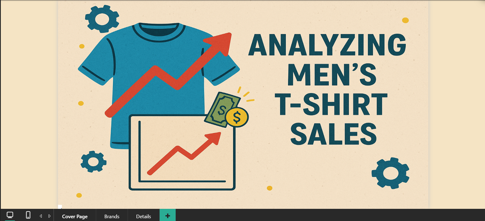

# 👕 Men's T-Shirt Sales Analysis

This Power BI report analyzes **sales performance** of various men's T-shirt brands in a retail store.

---

## 📌 Project Details
- **Tools Used**: Azure SQL, Power BI, PowerQuery, DAX
- **Data Source**: Azure SQL Database (partially cleaned before import)
- **Key DAX Functions**: Custom calculations for `Discount %`, `Profit %`, `Cost Price`
- **Metrics**:
  - Top 5 brands by average sales price
  - Profitability analysis
  - Discount trends

---

## 📸 Dashboard Preview

---

## 🧠 Key Insights
- Higher discounts above 20% reduce profit margins significantly
- Brand X leads in profit %, Brand Y dominates in volume
- Price vs. quantity trends vary greatly by brand
