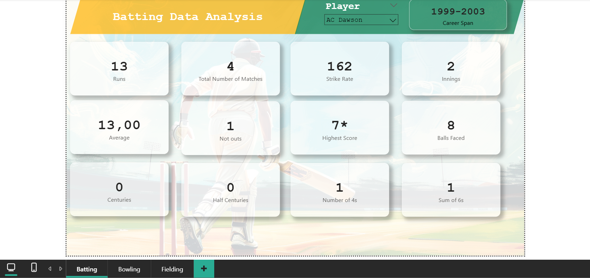
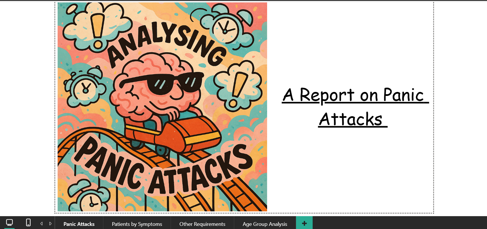
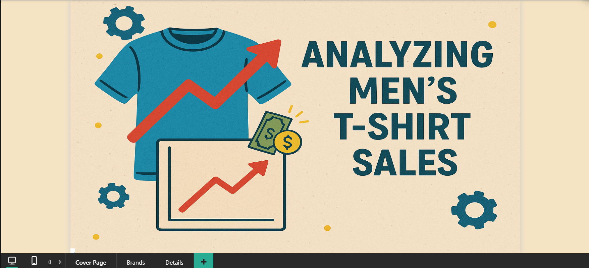

---

## 🙋🏾‍♀️ About Me

Hi there, welcome to my data portfolio. This repository showcases my skills and work in **Data**, including dashboards, ETL pipelines, and data workflows and analysis. I'm a young Data enthusiast turning messy numbers into clear insights. I design ETL pipelines, clean and transform data, and build dashboards and queries to tell compelling stories. Forever curious, always learning 👩🏾‍💻

Let’s connect on [LinkedIn](https://www.linkedin.com/in/sisanda-m-sibanda-7a2b941aa) and talk all things data 📊

---

## 📊 Power BI Projects

| Project | Preview | Description | Tools & Techniques |
|---------|---------|-------------|--------------------|
| [🏏 **Cricket Analysis**](PowerBIProjects/CricketAnalysis) |  | Player-level analysis of South Africa vs India matches, covering batting, bowling, and fielding stats. | Power BI, PowerQuery, DAX (`LOOKUPVALUE`, `RANKX`, `POWER`, `ABS`), Web Scraping |
| [🧠 **Panic Attack Insights**](PowerBIProjects/PanicAttackInsights) |  | Analysis of panic attack patterns, triggers, and durations, segmented by age group. | Power BI, Snowflake, PowerQuery, DAX (`IF`, `SWITCH`, `COUNTROWS`, `FILTER`, `DIVIDE`) |
| [👕 **Men's T-Shirt Sales Report**](PowerBIProjects/TShirtSalesReport) |  | Sales and profitability insights for men’s T-shirt brands, including top brands by price and profit %. | Power BI, Azure SQL, PowerQuery, DAX (custom `Discount %`, `Profit %`, `Cost Price`) |

---

## ⚙️ Data Engineering Projects

### 1. Automated GDP ETL Pipeline
**Description**:  
This project automates the extraction, transformation, and loading (ETL) of global GDP data from the International Monetary Fund (IMF) website. The pipeline fetches the latest GDP figures by country, rounds GDP values to two decimal places, and loads the cleaned data into both a JSON file and a SQLite database. It also logs the ETL process and runs a validation query to display countries with GDPs over 100 billion USD.  
**Tools Used**: Python, Pandas, BeautifulSoup4, SQLite3, Logging  
**Code Repository**: [GDP_ETL_Pipeline](https://github.com/Sanda-316/DataPortfolio/tree/main/DataEngineeringProjects/GDP_ETL_Pipeline)

---

### 2. Automated ETL Pipeline for Top 10 Largest Banks by Market Capitalization
**Description**:  
In this project, I built an automated ETL pipeline for a research organization to compile, transform, and store data on the top 10 largest banks in the world by market capitalization. The pipeline extracts the latest bank rankings (in USD), transforms values into GBP, EUR, and INR using exchange rates from a CSV file, and loads the results into both a CSV and a SQLite database. The system is designed for quarterly automated execution.  
**Tools Used**: Python, Pandas, Requests, SQLite3, Logging  
**Code Repository**: [ETL_World's_Largest_Banks](https://github.com/Sanda-316/DataPortfolio/tree/main/DataEngineeringProjects/ETL_World%27s_Largest_Banks)

