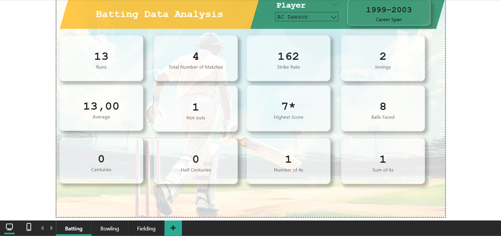

 # 📊 Sisanda's Data Portfolio

Hi there, welcome to my data portfolio. This repository showcases my skills and work in **Power BI** and **Data Engineering**, including dashboards, ETL pipelines, and data workflows.

---

## 📁 About Me

👩🏾‍💻 Just your friendly neighborhood data enthusiast, crunching numbers and chasing insights!  
I’m all about turning messy data into “aha!” moments. Whether it's slicing cricket stats or decoding panic attack patterns, I live for digging into the data and telling stories with it—charts, dashboards, queries and all. Always learning and forever curious.  
Let’s connect on [LinkedIn](https://www.linkedin.com/in/sisanda-m-sibanda-7a2b941aa) and talk all things data (or cricket, or T-shirts... you’ll see why)! 🏏👕📊

---

## 🔷 Power BI Data Analyst Projects

## 📊 Power BI Projects

| Project | Preview | Description | Tools & Techniques |
|---------|---------|-------------|--------------------|
| [🏏 **Cricket Analysis**](PowerBIProjects/CricketAnalysis) |  | Player-level analysis of South Africa vs India matches, covering batting, bowling, and fielding stats. | Power BI, PowerQuery, DAX (`LOOKUPVALUE`, `RANKX`, `POWER`, `ABS`), Web Scraping |
| [🧠 **Panic Attack Insights**](PowerBIProjects/PanicAttackInsights) |  | Analysis of panic attack patterns, triggers, and durations, segmented by age group. | Power BI, Snowflake, PowerQuery, DAX (`IF`, `SWITCH`, `COUNTROWS`, `FILTER`, `DIVIDE`) |
| [👕 **Men's T-Shirt Sales Report**](PowerBIProjects/TShirtSalesReport) |  | Sales and profitability insights for men’s T-shirt brands, including top brands by price and profit %. | Power BI, Azure SQL, PowerQuery, DAX (custom `Discount %`, `Profit %`, `Cost Price`) |

---

